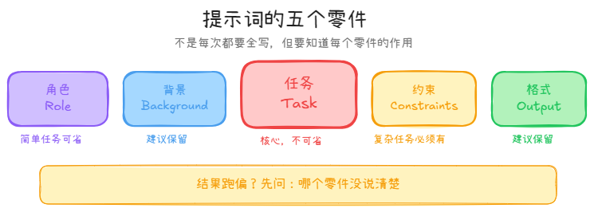
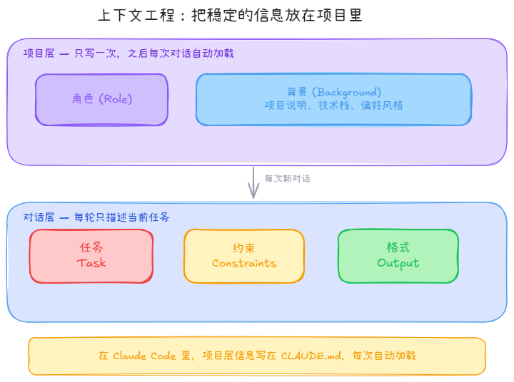

# 提示词进阶

## 先说一个直觉

你有没有跟一个新同事解释过一件复杂的事？

解释得好不好，不在于你说了多少话，而在于你有没有先把对方需要知道的背景交代清楚，然后一步步带着他走。

跟 AI 说话也是这个逻辑。它不会猜你的意思，但它很擅长在你给够信息的时候做出好结果。所谓提示词工程，本质上就是**把你脑子里的隐性要求，变成它能执行的明确指令**。

---

## 一个提示词能拆成几部分

不是每次都要全写，但知道有哪些零件，你才能知道哪里缺了什么：

**角色 (Role)** — 告诉它用什么身份来思考这个问题。"你是一个小红书博主"和"你是一个产品经理"，面对同一个问题会给出完全不同的答案。

**背景 (Background)** — 你的处境、你的用户、你的限制。这是最容易被忽略、也最影响结果质量的部分。

**任务 (Task)** — 具体要做什么，越明确越好。"帮我写文案"和"帮我写一段 150 字的小红书开头，产品是防晒霜，读者是大学生，疑问句开头"，差距是质变不是量变。

**约束 (Constraints)** — 不要做什么、边界在哪。注意：约束是用来**减少错误**的，不是用来提升质量的。创意类任务加太多约束会让结果越来越平。

**格式 (Output)** — 你想要表格、列表、还是一段话。不说清楚，它会自己决定，有时候你会不喜欢。



---

## 什么时候要把这些全写，什么时候不用

**日常对话、临时问题**：随便说，不需要结构。问它某个词怎么翻译、帮你改一段话，直接说就行。

**有点复杂的任务**：至少把任务和约束说清楚。角色可以加，不加也不影响大局。

**复杂的、要反复用的任务**：值得花时间写完整。比如你要策划一个系列内容，或者你在开发一个产品原型，把背景交代清楚能省掉后续很多来回。

一个实用的判断方式：**如果你拿到结果之后第一反应是"不对不对这不是我要的"，大概率是背景没说够，或者任务说得太模糊。**

---

## 关于图片：什么时候发，要不要描述

Claude 能直接看懂图片，不需要你先把图片内容打成文字。但什么时候加说明，有个简单的判断：

**直接发就够了：**
- 截图里有文字，让它帮你总结、翻译、分析
- 发竞品笔记图，问它这篇的结构和亮点
- 发产品图，让它写种草文案
- 发你做的原型截图，让它提修改意见

**发图 + 加一句话：**
- 你的问题只涉及图片的某个局部："重点看左边那个按钮的位置"
- 你想让它从特定视角来看："以一个第一次用这个 app 的人的视角"
- 图片里有多种元素，你想聚焦其中一个

**加了描述反而更麻烦的情况：**
- 截图模糊、文字看不清，这时候换一张清晰的更有效
- 你描述图片的时间比直接说需求还长——那就直接说需求就好

> **记住一条原则：** 发图是为了省力，不是为了仪式感。如果你只是懒得打字，直接发图就行；如果你有特定的关注点，一句话说清楚。

---

## 在开发工具时，提示词逻辑略有不同

如果你用的是 Claude Code、Cursor 这类工具做产品开发，有一件事值得单独说：

**角色和背景不是每次对话都要重新写的。**

这类工具有一个"系统上下文"的机制——你把项目背景、技术栈、你的偏好风格一次性告诉它，之后每一次对话它都记得。这叫**上下文工程**：把稳定不变的信息放在项目层面，把每次变化的具体任务放在对话里。



每次对话前再粘贴一遍"你是一个前端工程师，我们在做一个……"是在浪费你自己的时间。

在开发时，你的提示词重心应该从"交代背景"转向"描述当前问题"：
- 这个组件现在有什么 bug
- 我想加一个什么功能，入口在哪里
- 这个地方的交互逻辑我想改成什么样

越具体，越省来回。

---

## 结果不好怎么排查

拿到一个不理想的结果，先别急着重新问一遍——想一秒钟：**它是在哪一步理解偏了？**

| 现象 | 大概率原因 | 怎么修 |
|------|-----------|--------|
| 方向整体跑偏 | 背景没说够，或者它理解了一个错误的场景 | 补充或修正 Background |
| 内容对但格式乱 | 没指定输出格式 | 加 Output 要求，或者给一个例子 |
| 太表浅、没有深度 | 任务太笼统 | 把任务拆细，一个对话只做一件事 |
| 风格不是你要的 | 没有参考样本 | 粘贴 1-2 个你喜欢的例子进去 |
| 以上都试了还不行 | 可能真的换一个模型会更好 | 试试 ChatGPT 或 Gemini |

---

## 让 AI 帮你检查结果

这是很多人没用到的一个技巧：**让它自己对照你的要求检查输出**。

在提示词最后加一句：
> 输出完成后，逐条检查是否符合上面的所有要求，如有不符请直接修改。

这一句能挡掉相当一部分"漏掉约束"的低级错误。

在产品开发里，这个思路可以走得更远——未来你可以给 AI 配上"截图工具"，让它直接看到自己改动之后页面的实际效果，不需要你每次截图再粘贴给它。这类能力扩展叫做 Agent 工具，以后会单独讲。

---

## 不同工具简单对比

| 工具 | 适合什么 | 一句话建议 |
|------|---------|-----------|
| **Claude** | 理解复杂指令、写长文、做产品开发 | 结构化提示词效果最好，上下文给够它会很稳 |
| **ChatGPT** | 发散思路、创意头脑风暴 | 少约束，让它自由发挥 |
| **Gemini** | 需要最新信息的任务 | 可以让它搜索并引用来源 |
| **Kimi** | 处理长文档 | 直接把文件扔进去，让它读完再问 |
| **v0** | 快速出产品原型 | 描述你想要的界面，它直接生成可用代码 |

> 没有哪个工具是万能的。同一个任务，换个工具试试，有时候结果差很多。

---

## 一个可以现在就用的模板

适合内容策划、产品需求梳理这类有一定复杂度的任务：

```
你是一个[角色]。

背景：[你的项目/账号/产品的基本情况，2-3 句话]

任务：[具体要做什么]

要求：
- [约束 1]
- [约束 2]

输出格式：[表格 / 分点列出 / 直接写正文]

完成后，检查是否符合所有要求。
```

用这个框架试一次，然后根据结果判断哪里还需要补。提示词是迭代出来的，不是一次写好的。

---

## 用完之后，多问自己一句话

技巧学得再熟，也只是"会用 AI"。

真正有价值的判断力，是在用了一段时间之后慢慢长出来的——**你开始知道哪些事情交给 AI 又快又好，哪些事情它看起来做了，但其实需要你仔细检查，哪些事情根本就不应该让它来做。**

这种感觉不会自己出现。需要你每次用完之后，花十秒钟问自己一句：

> 这次的结果，是因为我提示词写得好，还是这件事本身就适合 AI 做？

两个答案指向不同的方向：

- 如果是**提示词的功劳**——说明你还有优化空间，下次试着写得更简洁，看结果会不会一样好。
- 如果是**任务本身适合 AI**——把这类任务记住，以后遇到类似的直接用，不用纠结。

积累到一定程度，你会自然形成一张属于自己的"AI 擅长 / 不擅长"的地图。

这张地图，才是从"会用工具的人"走向"能判断产品的人"的真正起点。